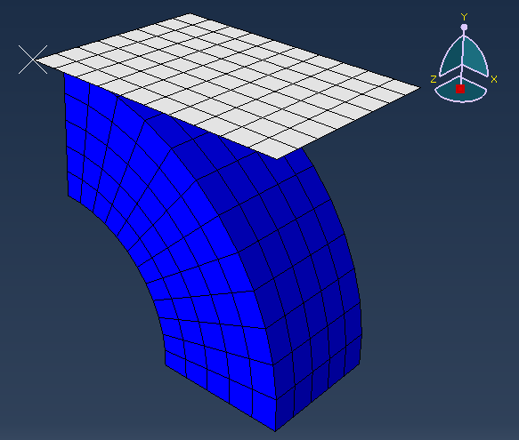
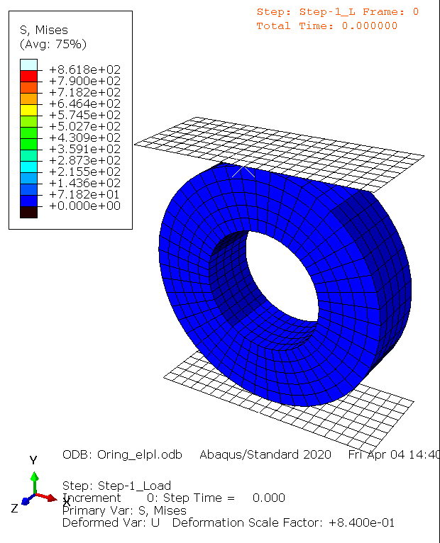
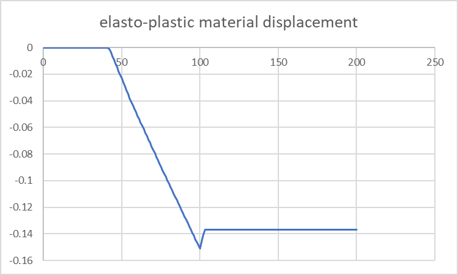
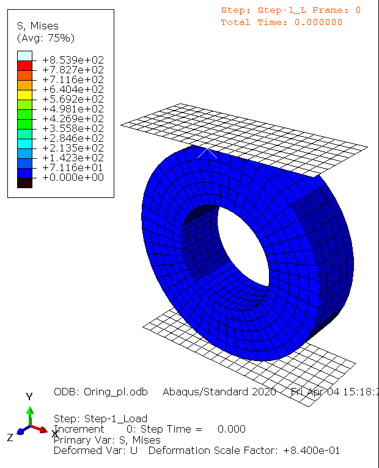
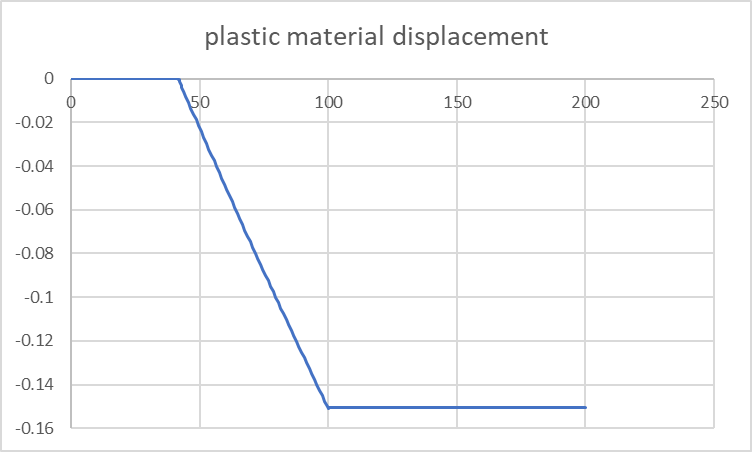

# Introduction
Examples of simulation differences based on different material properties in the O-ring simulation using Abaqus/standard.

## 1. Part
A quarter ring with a central hole, diameter, and thickness of 1 mm. Ring's mesh size set to 0.2. 
Rigid plane to press ring. Distance of two part is 0.1.

## 2. Boundary Counditions
### 2-1. Symmetry/Antisymmetry/Encastre
Based on the picture above, a fixed value was applied to the quarter ring, and *XSYMM* was applied to the symmetric plane close to the plane and *YSYMM* was applied to the symmetric plane far away.
### 2-2. Displacement/Rotation
Step 1
| Plane's Displacement/Rotation | Value |
|:------------------------------|:------|
| U1                            |   0   |
| U2                            | -0.25 |
| U3                            |   0   |
| UR1                           |   0   |
| UR2                           |   0   |
| UR3                           |   0   |

Step 2
| Plane's Displacement/Rotation | Value |
|:------------------------------|:------|
| U1                            |   0   |
| U2                            | 0.25  |
| U3                            |   0   |
| UR1                           |   0   |
| UR2                           |   0   |
| UR3                           |   0   |

## 3. Interaction
### 3.1 Interaction properties

| Contact property     |                     |
|:---------------------|:--------------------|
| Option               | Tangential Behavior |
| Friction formulation | Penalty             |
| Frisction Coeff      | 0.1                 |

### 3.2 Interactions
Surface to surface contact(Standard)
| Contact property      |                            |
|:----------------------|:---------------------------|
| Master surface        | Lower surface of a plane   |
| Slave surface         | Upper surface of the Oring |
| Discretization method | 0.1                        |

## 4. Material Properties
### 4.1 elastic & elasto-plastic

Elastic property value
| Young's Modulus | Poisson's Ratio |
|:----------------|:----------------|
| 210000          | 0.3             |

Plastic property value
| Yield Stress | Plastic Strain |
|:-------------|:---------------|
| 755          | 0              |
| 785          | 0.005          |
| 810          | 0.01           |
| 829          | 0.02           |
| 840          | 0.05           |
| 860          | 0.1            |
| 875          | 0.15           |
| 900          | 0.25           |
| 930          | 0.4            |
| 970          | 0.7            |
| 1000         | 1              |
| 1050         | 2              |
| 1080         | 3              |
| 1110         | 4              |

 
*elastic material*

 
*elasto-plastic material*

### 4.2 only plastic

 
*plastic material*

### 4.3 stress strain curve

